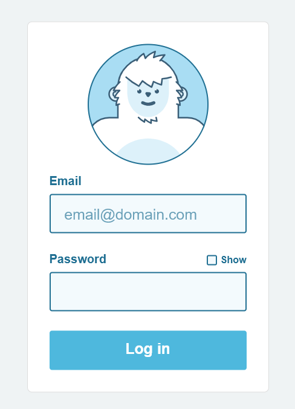

# Examen módulo 1 - UF1304

1. Haz un Fork de este repositorio
2. Clona tu fork en tu ordenador
3. Crea una rama con tu nombre
4. Haz el examen
5. Cuando lo temines, haz merge a la rama main
6. Sube la rama main: git push
7. Haz un fork (No hace falta que hagas pull si tus compañeros han subido sus exámenes)


## Tareas

## Tarea 1: Crea el formulario del Yeti



- imagen: yeti.svg
- Main color: #4eb8dd;
- background de formularios: #f3fafd;
- Fondo de fuera del formulario: #eff3f4;
- Formulario: #ffffff;
- Bordes: #217093;
- Crea un index.html y un style.css

## Tarea 2:

- Crea un archivo de javascript: script.js y enlázalo al index.html que has creado en el ejercicio anterior. Haz los 2 ejercicios en el mismo script.js
### Ejercicio 1:

Pide al usuario su edad con prompt y muestra un mensaje:

- Si es menor de 18, mostrar: "Eres menor de edad."

- Si tiene 18 o más, mostrar: "Eres mayor de edad."

### Ejercicio 2:

Pide al usuario un número con prompt y muestra en consola todos los números desde ese número al 1.


Si el usuario escribe 5, el programa debe mostrar:
````
    5
    4
    3
    2
    1
````

¡Que aproveche equipo! 👩‍🍳